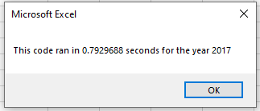
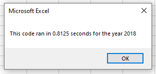

# Returns on Stocks for the Years 2017 and 2018

## Overview of Project
For this project, we were tasked with looking at stock data from 2017 and 2018 and help Steve help his parents diversify their
portfolios with stocks for companies that make alternative energy sources. We wrote one program in VBA and then refactored it
to hopefully make the run time of the program shorter.

## Results

First of all, there is a clear difference in stock performance between the years 2017 and 2018. Out of the 12 stocks we analyzed, there
was only one that had a negative return in 2017. On the other hand, there were only two stocks that had a positive return in 2018. After 
refactoring, we were able to get the same exact results. Additionally, after refactoring we were able to run the macro with a slightly
faster execution time. For the original VBA script, the execution time was around 0.85 seconds or higher for both 2017 and 2018. However,
the execution times on the refactored script is around 0.79 seconds for 2017 and 0.81 seconds for 2018. Screenshots for the times on the 
refactored script can be seen here: 

## Summary

### What are the advantages or disadvantages of refactoring code?
One big advantage to refactoring code is the amount of time it takes to execute the macro. This could make it better when you have extremely
large data sets. Another advantage of it is that it makes the coding simpler for other people to go in and look at. For example, if you 
are on a team and another member on the team needs to look at something, it could be much easier with refactored code. One disadvantage to
refactored coding is that it takes time to actually refactor the code. If you are working on a small data set it might not be worth the time
to refactor the code and just go along with the original code. Another disadvantage is that the refactored code might not be correct and
could bring up some bugs.

### How do these pros and cons apply 
For this project, we know that the coding is correct because it matches the output to the original VBA script. Since the execution times are
under one second for both years in each script, it might not make sense to refactor this code with this amount of data. However, if there
were thousands of stocks to analyze, the time difference between the two scripts would only get larger. So, with these 12 stocks the 
refactoring does not matter that much, but it would if we started looking at more stocks. Since we know the script works with a small 
amount of stocks, we can now apply it to larger data sets.
